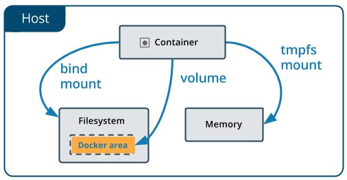
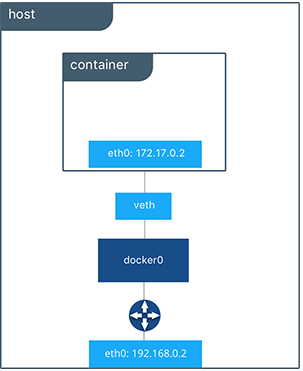

# DOCKER

## Container
1. Holds things: Something is either inside the container or outside the container
2. Is portable: It can be used on the local machine, a coworker's machine or a cloud
3. Has clear interfaces for access: It has ports that can be opened for inteacting through the browser or interact with data through the command line
4. Can be obtained from a remote location: An offsite **registry** keeps an image (which is a mold) for your container

## Image
Docker images are like blueprints or molds. They are immutable master templates to create our containers.

## Dockerfile
File that refers to a base image that is used to build the initial layer of the container.
Is a set of instructions to build the container as we want it.
A Dockerfile instruction is a capitalized word at the start of a line followed by itsarguments.
Exemple:
```docker
FROM ubuntu:18.04
COPY . /app
```
Only the instructions FROM, RUN, COPY and ADD create layers in the final image. Other instructions configure things, add metadata, or tell Docker to do something at run time, such as expose a port or run a command.

### A Dozen Dockerfile Instructions
`FROM` - specifies the base (parent) image  
`LABEL` - provides metadata. Good place toinclude maintainer info.  
`ENV` - sets a persistent environment variable  
`RUN` - runs a command and creates an image layer. Used to install packages into containers   
`COPY` - copies files and directories to the container  
`ADD` - copies files and directories to the container. Can unpack local `.tar` files  
`CMD` - provides a command and arguments for an executing container. Parameters can be overwritten. There can only be **ONE** `CMD`  
`WORKDIR` - sets the working directory for the instructions that follow  
`ARG` - defines a variable to pass to Docker at build-time  
`ENTRYPOINT` - provides commands and arguments for an executing container. Arguments persist  
`EXPOSE` - exposes a port  
`VOLUME` - creates a directory mount point to access and store persistent data  

### Instructions and Exemples
A Dockerfile can be as simple as this single line:
```docker
FROM ubuntu:18.04
```

**FROM**  
A Dockerfile **must** start with a FROM instruction or an ARG instruction followed by a FROM instruction.
The FROM keyword tells Docker to use a base image that matches the provided repository and tag. A base image is also called a parent image.
in this case _ubuntu_ is the image repository and the tag is _18.04_, this tag tells Docker which version of ubuntu to pull from the repository. If no tag is defined, then Docker assumes the _latest_ tag by default.

When you build an image locally for the first time Docker downloads that image once, anytime you re-build from that image Docker uses the already downloaded image instead. (see [caching](#caching))

### A More Substantive Dockerfile
Although the one line Dockerfile is concide it is also slow, provides little information and does nothing at container runtime.
The following exemple builds a smaller size image and executes a script at runtime:
```dockerfile
FROM python:3.7.2-alpine3.8

LABEL maintainer="sercustodio@gmail.com"
ENV ADMIN="sergio"

# Set current working directory
WORKDIR /usr/src/my_app_directory

RUN apk update && apk upgrade && apk add bash

# Copy code from your local context to the image working directory
COPY . ./app

ADD https://raw.githubusercontent.com/discdiver/pachy-vid/master/sample_vids/vid1.mp4 \
/my_app_directory

# Set default value for a variable
ARG my_var=my_default_value

# Set code to run at container run time
ENTRYPOINT ["python", "./app/my_script.py", "my_var"]

# Expose our port to the world
EXPOSE 8000

RUN ["mkdir", "/a_directory"]

# Create a volume for data storage
VOLUME /my_volume

CMD ["python", "./my_script.py"]
``` 
**Explanation:**

Here the base image is _python_ with the _3.7.2-alpine3.8_ tag (from its [source code](http://tiny.cc/xwi73y) we can see that this images has alpine as its base image and python over that).

#### LABEL  
The next instruction is LABEL.
LABEL adds metadata to the image. In this case it provides the image maintainer's contact info. Labels don't slow down builds or takeup space and they provide usefull information about the Docker Image.

#### ENV
ENV sets the persistent environment variable that is available at container run time. In this exemple I set the variable ADMIN when creating the container. 

ENV is nice for setting constants. If you are using the same value multiple times in your Dockerfile you might want to register that as a ENV constant.
<hr>
With Dockerfiles there are often multiple ways to accomplish the same thing. The best method for your case is a matter of balancing Docker conventions, transparency, and speed. For example, RUN, CMD, and ENTRYPOINT serve different purposes, and can all be used to execute commands.

#### RUN  
RUN creates a layer at builmd time. Docker commits the state of the image after each RUN.
RUN is often used to install packages into an image. In the exemple `RUN apk update && apk upgrade && apk add bash`  tells Docker to update and upgrade the packages from the base image and to install _bash_ into the image.
_apk_ stands for _Alpine Linux package manager_. If you're using a Linux base image in a flavor other than Alpine, then you’d install packages with `RUN apt-get` instead of _apk_. `apt` stand for _advanced package tool_

RUN, CMD and ENTRYPOINT can be used in exec form or shell form. Exec form uses JSON array syntax like:  
`RUN ["my_executable", "my_first_param1", "my_second_param2"]`.

In the exemple I used the shell form for   
`RUN apk update && apk upgrade && apk add bash`   
and later the exec form for   
`RUN ["mkdir", "/a_directory"]`

#### COPY  
The `COPY . ./app` instruction tells Docker to take the files and folders in the local build context and add them to the Docker image's current working directory. Copy will create the target directory if it doesn't exist.

#### ADD
ADD does the same thing as COPY, but has two more use cases. ADD can be used to move files from a remote URL to a container and ADD can extract local TAR files.

I used ADD in the example above to copy a file from a remote url into the container’s `my_app_directory`. The Docker docs don’t recommend using remote urls in this manner because you can’t delete the files. Extra files increase the final image size.

The Docker docs also suggest using COPY instead of ADD whenever possible for improved clarity.
Note that the ADD instruction contains the `\` line continuation character. Use it to improve readability by breaking up a long instruction over several lines.

#### CMD  
CMD provides Docker a command to run when a container is started. It does not commit the result of the command into the image. 
In the exemple Docker is instructed to execute the `my_script.py` file at the run time.

A few other things about CMD:
* Only one CMD instruction per Dockerfile. Otherwise all but the final one are ignored.
* CMD can include an executable. If CMD is present whithout an executable, then an ENTRYPOINT instruction must exist. In that case, both CMD and ENTRYPOINT instructions should be in JSON format.
* Command line arguments to `docker run` override arguments provided to CMD in Dockerfile.

Note that you can use comments in a Dockerfile. Comments start with `#`.

#### WORKDIR
WORKDIR changes the working directory in the container for the COPY, ADD, RUN, CMD and ENTRYPOINT instructions that follow it. A few notes:
* It’s preferable to set an absolute path with WORKDIR rather than navigate through the file system with `cd` commands in the Dockerfile.
* WORKDIR creates the directory automatically if it doesn’t exist.
* You can use multiple WORKDIR instructions. If relative paths are provided, then each WORKDIR instruction changes the current working directory.

#### ARG
ARG defines a variable to pass from the command line to the image at build-time. A default value can be supplied for ARG in the Dockerfile, as it is in the example: `ARG my_var=my_default_value`.

Unlike ENV variables, ARG variables are not available to running containers. However, you can use ARG values to set a default value for an ENV variable from the command line when you build the image. Then, the ENV variable persists through container run time. Exemple:
```Dockerfile
ARG buildtime_variable=default_value
ENV env_var_name=$buildtime_variable
```

When you’re building your image, you can override the default_value directly from the command line:
```terminal
$ docker build --build-arg buildtime_variable=a_value # [...]
```
The value of the ARG variable will be overridden with the one you provided, and during the build the ENV value will be set to your provided value as well. Although the ARG variable will not be available to future containers, the passed ENV value will be there to be used. Once you run the container, you’ll have a default value for the environment variable, unless you choose to override it.

#### ENTRYPOINT
The ENTRYPOINT instruction also allows you to provide a default command and arguments when a container starts. It looks similar to CMD, but ENTRYPOINT parameters are not overriden if a container is run with command line parameters.

Instead, command line arguments passed to `docker run my_image_name` are appended to the ENTRYPOINT instruction’s arguments. For example, `docker run my_image bash` adds the argument _bash_ to the end of the ENTRYPOINT instruction’s existing arguments.

A Dockerfile should have at least one CMD or ENTRYPOINT instruction.

The Docker docs have a few suggestions for choosing between CMD and ENTRYPOINT for your initial container command:

* Favor ENTRYPOINT when you need to run the same command every time.
* Favor ENTRYPOINT when a container will be used as an executable program.
* Favor CMD when you need to provide extra default arguments that could be overwritten from the command line.

In the exemple, `ENTRYPOINT ["python", "my_script.py", "my_var"]` has the container run the the _python_ script _my_script.py_ with the argument _my_var_ when the container starts running. Note that _my_var_ has a default value supplied by ARG earlier in the Dockerfile. So if an argument isn’t passed from the command line, then the default argument will be used.

Docker recommends you generally use the exec form of ENTRYPOINT: 
`ENTRYPOINT ["executable", "param1", "param2"]`.   
This form is the one with JSON array syntax.

#### EXPOSE
The EXPOSE instruction shows which port is intended to be published to provide access to the running container. EXPOSE does not actually publish the port. Rather, it acts as a documentation between the person who builds the image and the person who runs the container.
Use `docker run` with the `-p` flag to publish and map one or more ports at run time. The uppercase `-P` flag will publish all exposed ports.

#### VOLUME
To talk about VOLUME I must first talk about data.
Data in Docker can either be temporary or persistent.

**Temporary Data**  
Data can be kept temporarily inside a Docker container in 2 ways.
By default, files created by an application inside a container are stored in the writable layer of the container. You don’t have to set anything up. This is the quick and dirty way. Just save a file and go about your business. However, when you container ceases to exist, so will your data.

You have another option if you want better performance for saving temporary data with Docker. If you don’t need your data to persist beyond the life of the container, a _tmpfs_ mount is a temporary mount that uses the host’s memory. A tmpfs mount has the benefit of faster read and write operations.

**Persistent Data**  
There is also 2 ways of keeping persistent data.
One way is to bind mount a file system to the container. With a bind mount, processes outside Docker also can modify the data.  
  
Bind mounts are difficult to back up, migrate, or share with other Containers. Volumes are a better way to persist data.

**VOLUME** specifies where your container will store and/or access persistent data. Is a file system that lives on a host machine outside any container. Volumes are created and managed by Docker.  
Volumes are:
* persistent
* free-floating file systems, separate from any container
* sharable between containers
* efficient for input and output
* able to be hosted on remote cloud providers
* encryptable
* nameable
* able to have their content pre-populated by a container
* handy for testing

That’s a lot of useful functionality! Now let’s look at how you make a Volume.

#### Crating Volumes
Volumes can be created via a Dockerfile or an API request.

Here’s a Dockerfile instruction that creates a volume at run time:
```Dockerfile
VOLUME /my_volume
```
Then, when the container is created, Docker will create the volume with any data that already exists at the specified location. Note that if you create a volume using a Dockerfile, you still need to declare the mountpoint for the volume at run time.
You can also create a volume in a Dockerfile using JSON array formatting.

Volumes also can be instantiated at run time from the command line.

#### Volume CLI Commands

**Create**
You can create a stand-alone volume with: `docker volume create --name my_volume`

**Inspect**  
List Docker volumes with `docker volume ls`

Inspect the volume with: `docker volume inspect my_volume`

**Remove**
Remove volumes with `docker volume rm my_volume`

Dangling volumes are volumes not used by a container. You can remove dangling volumes with: `docker volume prune`, docker will warn you and ask for confirmation before deletion.
If the volume is associated with any containers, you cannot remove it until the containers are deleted. Even then, Docker sometimes doesn’t realize that the containers are gone. If this occurs, you can use `docker system prune` to clean up all your Docker resources. Then you should should be able to delete the volume.

#### Mount vs Volume
You will often use flags to refer to your volumes. For example, to create a volume at the same time you create a container use the following:

```terminal
docker container run --mount source=my_volume, target=/container/path/for/volume my_image
```
Originally, the `-v` or `--volume` flag was used for standalone containers and the `--mount` flag was used with Docker Swarms. However, beginning with Docker 17.06, you can use `--mount` in all cases.

The syntax for `--mount` is a bit more verbose, but it’s preferred over `--volume` for several reasons. `--mount` is the only way you can work with services or specify volume driver options. It’s also simpler to use.

You’ll see a lot of `-v`’s in existing code. Beware that the format for the options is different for `--mount` and `--volume`. You often can’t just replace a `-v` in your existing code with a `--mount` and be done with it.

The biggest difference is that the `-v` syntax combines all the options together in one field, while the `--mount` syntax separates them. Let’s see `--mount` in action!

`--mount` options are key-value pairs. Each pair is formatted like this: `key=value`, with a comma between one pair and the next. Common options:

`type` — mount type. Options are `bind`, `volume`, or `tmpfs`. We’re all about the volume.
`source` — source of the mount. For named volumes, this is the name of the volume. For unnamed volumes, this option is omitted. The key can be shortened to `src`.
`destination` — the path where the file or directory is mounted in the container. The key can be shortened to `dst` or `target`.
`readonly` — mounts the volume as read-only. Optional. Takes no value.

Here’s an example with lots of options:
```terminal
docker run --mount type=volume,source=volume_name,destination=/path/in/container,readonly my_image
```

[Dockerfile cheat sheet](http://tiny.cc/5an73y)

## Docker Essentials

### Docker Platform
Docker software that provids the ability to package and run applications in a container on any server. It bundles code files and dependencies and promotes easy scaling by enabling portability and reproducibility.

### Docker Engine
Client-server application. 

### Docker Daemon
Docker server that listens for Docker API requests, it manages images, containers, networks and volumes.

### Docker Volumes
Way of storing the persistent data that the app consumes and creates.

### Docker Registry
Remote location where the images are stored. You push images to a registry and you pull images from a registry.

### Docker repository
Collection of Docker images with the same name and different tags. _Tags_ are the identifiers of an image.

Usually a repository has different versions of the same image. For example, Python is the name of the most popular official Docker image repository on Docker Hub. Python:3.7-slim refers to the version of the image with the 3.7-slim tag in the Python repository.

## Scaling Docker
Using multiple containers at once

### Docker Networking
It allows to connect Docker containers together.
Connected Docker containers can be on the same host or multiple hosts.



There are 4 modes available for Docker Networking: _Bridge, Host, Container_ or _no networking_.

You can check the details [here](docker_networking.md)

### Docker Compose
Is a tool that makes it easy to run apps that require multiple Docker containers using a `docker-composeyml` file.

Exemple:
Using the following structure:
```
example1 
├── commander 
│ └── Dockerfile 
└── docker-compose.yml
```
and having the Dockerfile that builds Redis Commander ready, we then create the `docker-compose.yml`:

```yml
backend: 
  image: redis:3 
  restart: always

frontend: 
  build: commander 
  links: 
    - backend:redis  
  ports: 
    - 8081:8081 
  environment: 
    - VAR1=value 
  restart: always
```
when executing 
```terminal
docker-composer up -d
```
this will create 2 containers: `exemple1_backend_1` and `exemple1_frontend_1`, it will give both the option of `restart=always`, connect them through the port `8081` link the `frontend` container to its `backend` counterpart.

The Docker commands needed to do this would be:
```terminal
docker build -t commander commander

docker run -d --restart always --name frontend -e VAR1=value -p 8081:8081 --link backend:redis commander
```

### Docker Swarm
 Refers to cluster management and orchestration features embedded in Docker Engine. When you initialize a new swarm (cluster) or join nodes to a swarm, the Docker Engine runs in swarm mode.

### Docker Services
Those are the different pieces of a distributed app. From the docs:
> _Services are really just “containers in production.” A service only runs one image, but it codifies the way that image runs — what ports it should use, how many replicas of the container should run so the service has the capacity it needs, and so on. Scaling a service changes the number of container instances running that piece of software, assigning more computing resources to the service in the process._

Docker services allow you to scale containers across multiple Docker Daemons and make Docker Swarms possible.

### Caching
One of Docker’s strengths is that it provides caching to help you more quickly iterate your image builds.

When building an image, Docker steps through the instructions in your Dockerfile, executing each in order. As each instruction is examined, Docker looks for an existing intermediate image in its cache that it can reuse instead of creating a new (duplicate) intermediate image.

If cache is invalidated, the instruction that invalidated it and all subsequent Dockerfile instructions generate new intermediate images. As soon as the cache is invalidated, that’s it for the rest of the instructions in the Dockerfile.

So starting at the top of the Dockerfile, if the base image is already in the cache it is reused. That’s a hit. Otherwise, the cache is invalidated.
Then the next instruction is compared against all child images in the cache derived from that base image. Each cached intermediate image is compared to see if the instruction finds a cache hit. If it’s a cache miss, the cache is invalidated. The same process is repeated until the end of the Dockerfile is reached.

Most new instructions are simply compared with those in the intermediate images. If there’s a match, then the cached copy is used.

For example, when a `RUN pip install -r requirements.txt` instruction is found in a Dockerfile, Docker searches for the same instruction in its locally cached intermediate images. The content of the old and new requirements.txt files are not compared.

This behavior can be problematic if you update your requirements.txt file with new packages and use `RUN pip install` and want to rerun the package installation with the new package names. 

Unlike other Docker instructions, ADD and COPY instructions do require Docker to look at the contents of the file(s) to determine if there is a cache hit. The checksum of the referenced file is compared against the checksum in the existing intermediate images. If the file contents or metadata have changed, then the cache is invalidated.

Here are a few tips for using caching effectively.

* Caching can be turned off by passing `--no-cache=True` with `docker build`.
* If you are going to be making changes to instructions, then every layer that follows will be rebuilt frequently. To take advantage of caching, put instructions that are likely to change as low as you can in your Dockerfile.
* Chain `RUN apt-get update` and `apt-get install` commands to avoid cache miss issues.
* If you’re using a package installer such as pip with a _requirements.txt_ file, then follow a model like the one below to make sure you don’t receive a stale intermediate image with the old packages listed in requirements.txt.
```Dockerfile
COPY requirements.txt /tmp/
RUN pip install -r /tmp/requirements.txt
COPY . /tmp/
```

### Size Reduction
Docker images can get large. You want to keep them small so they can be pulled quickly and use few resources.

### .dockerignore
_.dockerignore_ files are something like _.gitignore_ files. It instructs Docker to ignore the files and folders, contained in the _.dockerignore_ file, when building the image.

Put your _.dockerignore_ file in the same folder as your Dockerfile and the rest of your build context.

When you run `docker build` to create an image, Docker checks for a _.dockerignore_ file. If one is found, it then goes through the file line by line to match file names for exclusion.

So `*.jpg` will exclude all files with a _.jpg_ extension, `videos` will exclude the folder videos and its content.
Inside the _.dockerignore_ file you can make comments explaining the exclusion by adding `#` at the start of the line.
Using _.dockerignore_ to exclude files you don’t need from your Docker image is a good idea. _.dockerignore_ can:

* help you keep your secrets from being revealed. No one wants passwords in their images.
* reduce image size. Fewer files means smaller, faster images.
* reduce build cache invalidation. If logs or other files are changing and your image is having its cache invalidated because of it, that’s slowing down your build cycle.

Those are the reasons to use a _.dockerignore_ file.

### Size Inspection
Let’s look at how to find the size of Docker images and containers from the command line.

* To view the approximate size of a running container, you can use the command `docker container ls -s`.
* Running `docker image ls` shows the sizes of your images.
* To see the size of the intermediate images that make up your image use `docker image history my_image:my_tag`.
* Running `docker image inspect my_image:tag` will show you many things about your image, including the sizes of each layer. Layers are subtly different than the images that make up an entire image. But you can think of them as the same for most purposes.

## 15 Docker Commands You Should Know
Here are a few things to know about Docker commands:
* All Docker CLI management commands start by `docker` then a space, then a management category, then a space, then the command. For exemple:
`docker container stop` stops a container 
* A command referring to a specific container or image requires the name or id of that container or image.

For example, `docker container run my_app` is the command to build and run the container named _my_app_. 
I’ll use the name `my_container` to refer to a generic container throughout the examples. Same goes for `my_image`, `my_tag`, etc.

I’ll provide the command alone and then with common flags, if applicable. A flag with two dashes in front is the full name of the flag. A flag with one dash is a shortcut for the full flag name. For example, `-p` is short for the `--port` flag.

### Container Commands
Use `docker container my_command`

`create` - creates a container from an image  
`start` - starts an existing container  
`run` - Creates a new container and starts it  
`ls` - lists running containers  
`inspect` - gives lots of info about a container  
`logs` - prints logs  
`stop` - stops running container  
`kill` - stops main process in container  
`rm` - removes stopped container  

#### Container Begginnings
The terms create, start, and run all have similar semantics in everyday life. 
But each is a separate Docker command that creates and/or starts a container. Let’s look at creating a container first.

`docker container create my_repo/my_image:my_tag` — Create a container from an image.

I’ll shorten `my_repo/my_image:my_tag` to `my_image` for the rest of the article.

There are a lot of possible flags you could pass to `create`.

`docker container create -a STDIN my_image`

`-a` is short for `--attach`. Attach the container to STDIN, STDOUT or STDERR.

Now that we’ve created a container let’s start it.

`docker container start my_container` — Start an existing container.

Note that the container can be referred to by either the container’s ID or the container’s name.

Now that you know how to create and start a container, let’s turn to what’s probably the most common Docker command. It combines both create and start into one command: run.

`docker container run my_image` — Create a new container and start it. It also has a lot of options. Let’s look at a few.

`docker container run -i -t -p 1000:8000 --rm my_image`

`-i` is short for `--interactive`. Keep STDIN open even if unattached.

`-t` is short for `--tty`. Allocates a pseudo terminal that connects your terminal with the container’s STDIN and STDOUT.

You need to specify both `-i` and `-t` to then interact with the container through your terminal shell.

`-p` is short for `--port`. The port is the interface with the outside world. 1000:8000 maps the Docker port 8000 to port 1000 on your machine. If you had an app that output something to the browser you could then navigate your browser to localhost:1000 and see it.

`--rm` Automatically delete the container when it stops running.

Let’s look at some more examples of run.

`docker container run -it my_image my_command`

`sh` is a command you could specify at run time. `sh` will start a shell session inside your container that you can interact with through your terminal. `sh` is preferable to `bash` for Alpine images because Alpine images don’t come with bash installed. Type `exit` to end the interactive shell session.

Notice that we combined `-i` and `-t` into `-it`.

`docker container run -d my_image`

`-d` is short for `--detach`. Run the container in the background. Allows you to use the terminal for other commands while your container runs.

#### Checking Container Status
If you have running Docker containers and want to find out which one to interact with, then you need to list them.

`docker container ls` — List running containers. Also provides useful information about the containers.

`docker container ls -a -s`

`-a` is short for `-all`. List all containers (not just running ones).

`-s` is short for `--size`. List the size for each container.

`docker container inspect my_container` — See lots of info about a container.

`docker container logs my_container` — Print a container’s logs.

#### Container Endings
Sometimes you need to stop a running container.

`docker container stop my_container` — Stop one or more running containers gracefully. Gives a default of 10 seconds before container shutdown to finish any processes.

Or if you are impatient:

`docker container kill my_container` — Stop one or more running containers abruptly. It’s like pulling the plug on the TV. Prefer `stop` in most situations.

`docker container kill $(docker ps -q)` — Kill all running containers.

Then you delete the container with:

`docker container rm my_container` — Delete one or more containers.

`docker container rm $(docker ps -a -q)` — Delete all containers that are not running.

Those are the eight essential commands for Docker containers.

To recap, you first create a container. Then, you start the container. Or combine those steps with `docker run my_container`. Then, your app runs.

Then, you stop a container with `docker stop my_container`. Eventually you delete the container with `docker rm my_container`.

Now, let’s turn to the magical container-producing molds called images.

### Image Commands
Use `docker image my_command`

`build` - builds an image  
`push` - pushes an image to a remote registry  
`ls` - lists images  
`history` - see intermediate image info  
`inspect` - see lots of info about an image, including the layers  
`rm` - removes an image  

#### Developing Images
`docker image build -t my_repo/my_image:my_tag` - Build a Docker image named _my_image_ from the Dockerfile located at the specified path or URL.

`-t` is short for `tag`. Tells docker to tag the image with the provided tag. In this case _my_tag_ .

The . (period) at the end of the command tells Docker to build the image according to the Dockerfile in the current working directory.

Once you have an image built you want to push it to a remote registry so it can be shared and pulled down as needed. Assuming you want to use Docker Hub, go there in your browser and create an account

This next command isn’t an image command, but it’s useful to see here, so I’ll mention it.

`docker login` — Log in to a Docker registry. Enter your username and password when prompted.

`docker image push my_repo/my_image:my_tag` — Push an image to a registry.

#### Inspecting Images
`docker image ls` — List your images. Shows you the size of each image, too.  

`docker image history my_image` — Display an image’s intermediate images with sizes and how they were created.  

`docker image inspect my_image` — Show lots of details about your image, including the layers that make up the image.

Sometimes you’ll need to clean up your images.

#### Removing Images
`docker image rm my_image` — Delete the specified image. If the image is stored in a remote repository, the image will still be available there.

`docker image rm $(docker images -a -q)` — Delete all images. Careful with this one! Note that images that have been pushed to a remote registry will be preserved — that’s one of the benefits of registries.

### Misc
`docker version` — List info about your Docker Client and Server versions.  
`docker login` — Log in to a Docker registry.  
`docker system prune` — Delete all unused containers, unused networks, and dangling images.  

`docker system prune -a --volumes`    

`-a` is short for `--all`. Delete unused images, not just dangling ones.  
`--volumes` Remove unused volumes.
