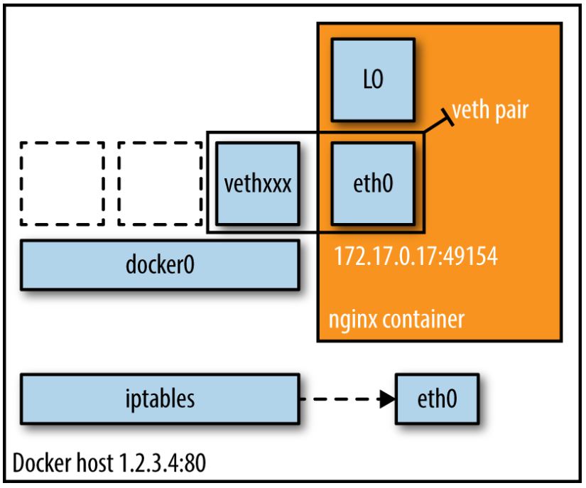
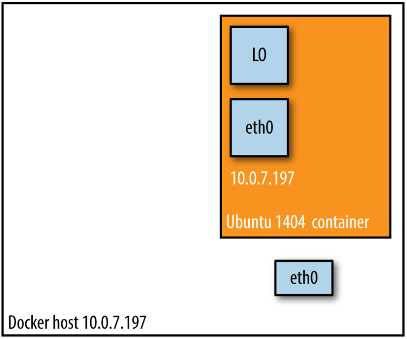

#### Bridge Mode



In this mode, the Docker Daemon creates `docker0`, a virtual Ethernet bridge that automatically forwards packats between any other network interfaces that are attached to it. By default, the daemon then connects all containers on a host to this internal network through creating a pair of peer interfaces, assigning one of the peers to become the container’s `eth0` interface and other peer in the namespace of the host, as well as assigning an IP address/subnet from the private IP range to the bridge

Exemple:
```terminal
$ docker run -d -P --net=bridge nginx:1.9.1
$ docker ps
CONTAINER ID 	IMAGE 		COMMAND 	CREATED 	STATUS 		PORTS 			NAMES 
17d447b7425d	nginx:1.9.1	nginx -g	19 seconds ago	Up 18 seconds	0.0.0.0:49153->443/tcp,	trusting_feyman
										0.0.0.0:49154->80/tcp
```

>
 _NOTE_:  
 _Because bridge mode is the Docker default, you could have equally used `docker run -d -P nginx:1.9.1` in example. If you do not use `-P` (which publishes all exposed ports of the container) or `-p host_port:container_port` (which publishes a specific port), the IP packets will not be routable to the container outside of the host._

#### Host Mode



This mode disables network isolation of a Docker container.
Because the container shares the networking namespace of the host, it is directly exposed to the public network; consequently, you need to carry out the coordination via port mapping.

Exemple:
```terminal
$ docker run -d --net=host ubuntu:14.04 tail -f /dev/null
$ ip addr | grep -A 2 eth0:
2: eth0: <BROADCAST,MULTICAST,UP,LOWER_UP> mtu 9001 qdisc mq state UP group default qlen 1000
    link/ether 06:58:2b:07:d5:f3 brd ff:ff:ff:ff:ff:ff
    inet **10.0.7.197**/22 brd 10.0.7.255 scope global dynamic eth0

$ docker ps
CONTAINER ID  IMAGE         COMMAND  CREATED 		STATUS        PORTS 	NAMES
b44d7d5d3903  ubuntu:14.04  tail -f  2 seconds ago  	Up 2 seconds            jovial_blackwell

$ docker exec -it b44d7d5d3903 ip addr
2: eth0: <BROADCAST,MULTICAST,UP,LOWER_UP> mtu 9001 qdisc mq state UP group default qlen 1000
    link/ether 06:58:2b:07:d5:f3 brd ff:ff:ff:ff:ff:ff
    inet **10.0.7.197**/22 brd 10.0.7.255 scope global dynamic eth0
```

In this mode the used network, by the container, is the same as the host, therefor the container gets the same IP address as the host.
This mode is faster than the bridge mode (because there is no routing overhead), but it exposes the container directly to the public network, with all its security implications.

#### Container Mode

With this mode you tell Docker to reuse the networking namespace of another container. In general, this mode is useful when you want to provide custom network stacks.

Exemple:
```terminal
$ docker run -d -P --net=bridge nginx:1.9.1
$ docker ps
CONTAINER ID  IMAGE        COMMAND   CREATED         STATUS 		PORTS 				NAMES
eb19088be8a0  nginx:1.9.1  nginx -g  3 minutes ago   Up 3 minutes	0.0.0.0:32769->80/tcp, 		admiring_engelbart
									0.0.0.0:32768->443/tcp     

$ docker exec -it admiring_engelbart ip addr
8: eth0@if9: <BROADCAST,MULTICAST,UP,LOWER_UP> mtu 9001 qdisc noqueue state UP group default
    link/ether 02:42:ac:11:00:03 brd ff:ff:ff:ff:ff:ff
    inet **172.17.0.3**/16 scope global eth0

$ docker run -it --net=container:admiring_engelbart ubuntu:14.04 ip addr
...
8: eth0@if9: <BROADCAST,MULTICAST,UP,LOWER_UP> mtu 9001 qdisc noqueue state UP group default
    link/ether 02:42:ac:11:00:03 brd ff:ff:ff:ff:ff:ff
    inet **172.17.0.3**/16 scope global eth0
``` 

In the example the second container (started with `--net=container`) takes the same IP address s the first container

#### No Networking

This mode puts the container inside of its own network stack but doesn’t configure it. Effectively, this turns off networking and is useful for two cases: either for containers that don’t need a network (such as batch jobs writing to a disk volume) or if you want to set up your custom networking.

Exemple:
```terminal
$ docker run -d -P --net=none nginx:1.9.1
$ docker ps
CONTAINER ID 	IMAGE 		COMMAND 	CREATED 	STATUS 		PORTS 		NAMES 
d8c268037c	nginx:1.9.1	nginx -global	2 minutes ago	Up 2 minutes			grave_perlman

$ docker inspect d8c268037c | grep IPAddress
	"IPAddress":"",
	"SecondaryIPAddress": null,
```

> NOTE  
All Docker commands in this article have been executed in a CoreOS environment with both Docker client and server on version 1.7.1

##### Allocating IP addresses
Manually allocating IP addresses when containers come and go frequently and in large numbers is not sustainable. The bridge mode takes care of this issue to a certain extent. To prevent ARP collisions on a local network, the Docker daemon generates a random MAC address from the allocated IP address.

##### Allocating ports
You will find yourself either in the fixed-port-allocation or in the dynamically-port-allocation camp. This can be per service/application or as a global strategy, but you must make up your mind. 
Remember that, for bridge mode, Docker can automatically assign (UDP or TCP) ports and consequently make them routable.

##### Network security
Out of the box, Docker has inter-container communication enabled (meaning the default is `--icc=true`); this means containers on a host can communicate with each other without any restrictions, which can potentially lead to denial-of-service attacks. Further, Docker controls the communication between containers and the wider world through the `--ip_forward` and `--iptables` flags. You should study the defaults of these flags and loop in your security team concerning company policies and how to reflect them in the Docker daemon setup. Also, check out the [Docker security analysis](https://containerjournal.com/2015/10/22/docker-docker-docker-security-docker/) Boyd Hemphill of StackEngine carried out.

